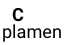
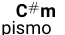
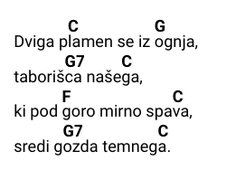
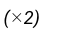

# Navodila za pisanje besedil/akordov


### Prvo dodaš besedilo:
```latex
\beginsong{NASLOV PESMI}[by={AVTOR}]

    \beginverse
        Vsako kitico posebaj daš v beginverse in endverse.
    \endverse

    \beginverse
        Primer še ene kitice
    \endverse

    \beginchorus
        Za refren namesto begin/end verse uporabiš begin/end chorus.
    \endchorus
\endsong
```


### Nato dodaš akorde:

* Mole piši s -mjem, torej: Am/Cm/Gm (Moli so akordi, ki so pisani s malimi črkami a,e,h => Am, Em, Hm)
* Akord dodaš s tem: \\[AKORD] ( \ - altgr + Q ; [] - altgr + F/G)
* \\[A] - to daš pred črko v besedi nad katero želiš, da se pojavi akord


`p\[C]lamen` se spremeni v:  

`p\[C#m]ismo` se spremeni v : 


#### Primer akordov:
```latex
\beginsong{NASLOV PESMI}[by={AVTOR}]
    \beginverse
        Dviga p\[C]lamen se iz \[G]ognja,
        taboriš\[G7]ca naše\[C]ga,
        ki pod \[F]goro mirno spa\[C]va,
        sredi g\[G7]ozda temneg\[C]a.
    \endverse
\endsong
```
#### To se spremeni v:



### Posebnosti:

Če akordi nimajo besedila:
`\nolyrics{ Uvod: \[G]-\[G]-\[G]-\[G] }` => 

Ponavljanje: `\rep{2}` ==> 